# surveycto-coffee-farmers-uganda

This repository is a public SurveyCTO/XLSForm work sample for field operations context: an AI advisory tool for smallholder coffee farmers in Uganda. The package is designed to demonstrate strong instrument engineering and field readiness, not agronomy depth.

Created by Erick Busuulwa ([devericklasco](https://github.com/devericklasco)).

## How this maps to Field Coordinator responsibilities

- Instrument design: Structured modules from setup through closeout, with practical skip logic and validation.
- Testing and debugging: Built-in constraints, safe calculations, and explicit testing notes for core paths.
- Translation support: Parallel English and Luganda labels/hints to support multilingual deployment.
- Enumerator readiness: A concise enumerator guide with consent script, probing standards, and GPS steps.
- Data quality assurance: Metadata capture, constraint messages, calculated indicators, and outcome coding.

## XLSForm technical features included

- Module-based design using `begin_group` and `end_group`.
- Skip logic using `relevant` expressions across consent, fertilizer, sales, and incomplete interview branches.
- Constraints with bilingual error messages (age, land, coffee acreage, yield, price, phone number, IDs).
- Safe calculations:
  - `yield_per_acre_kg = coffee_yield_kg / coffee_acreage` with divide-by-zero protection.
  - `duration_sec` from `start` and `end` using decimal datetime math.
  - `gps_accuracy_m` parsed from geopoint accuracy.
- Metadata and field ops variables: `start`, `end`, `today`, `deviceid`, `enumerator_id`, GPS, duration, and form status.
- “Other (specify)” patterns in multiple modules (income source, fertilizer type, challenges, advice topics, channels, incomplete reason).

## Import and testing in SurveyCTO (high level)

1. Open SurveyCTO server and create a new form.
2. Upload `coffee_farmer_survey.xlsx`.
3. Run the form tester to verify:
   - consent refusal path,
   - required field behavior,
   - skip logic,
   - constraints and messages,
   - calculations and metadata fields.
4. Publish and load to SurveyCTO Collect for device-based testing, including offline mode and GPS capture.
5. Review test submissions in table view and export CSV for QA checks.

## Export artifacts

- [SurveyCTO export report (PDF)](coffee_farmer_survey_uganda_demo_export_report.pdf)
- [SurveyCTO wide export (XLSX)](AI%20Advisory%20Tool%20for%20Smallholder%20Coffee%20Farmers%20-%20Uganda_WIDE.xlsx)
- [Synthetic sample export (CSV)](sample_export.csv)

## Screenshots

### Form and logic evidence

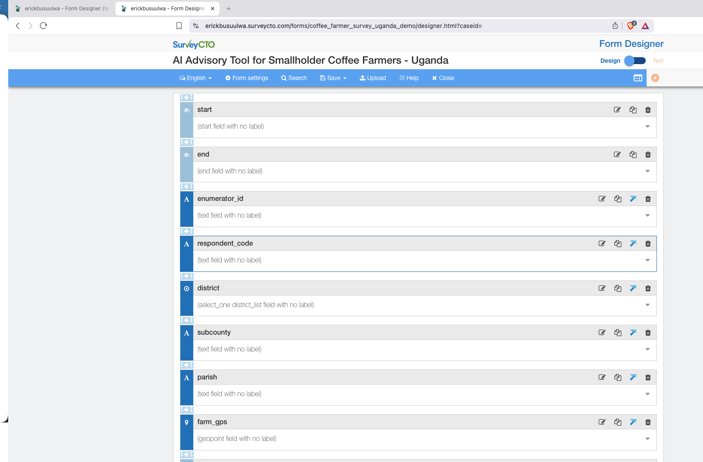
Form definition loaded in SurveyCTO designer and ready for testing.

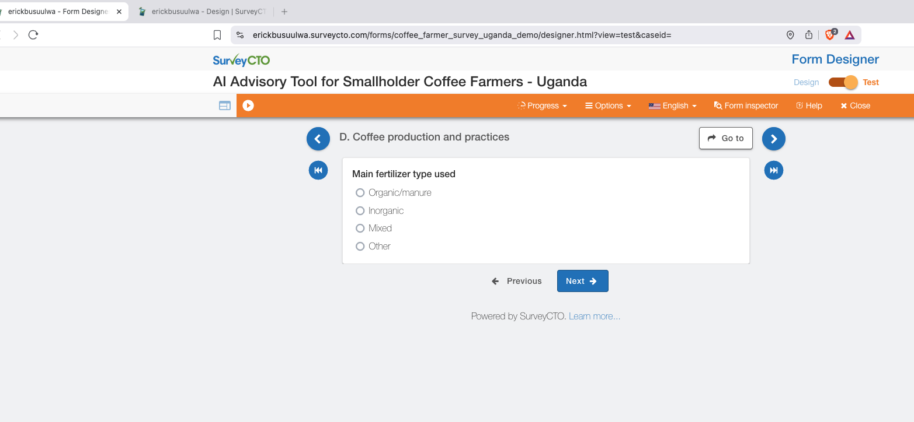
Skip logic in action: `fertilizer_type` appears when `fertilizer_use = yes`.

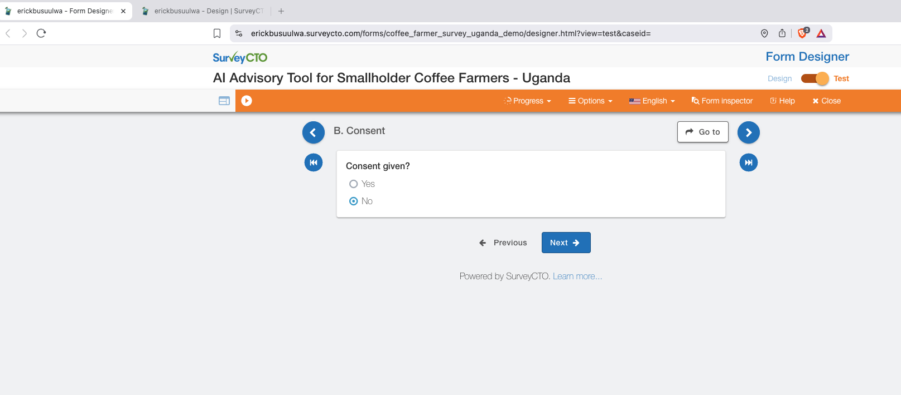
Consent refusal path captured in the web tester.

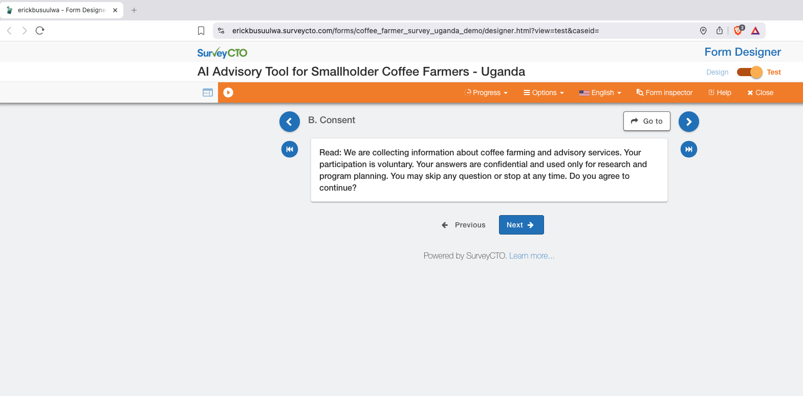
Consent script display in test mode for enumerator reading consistency.

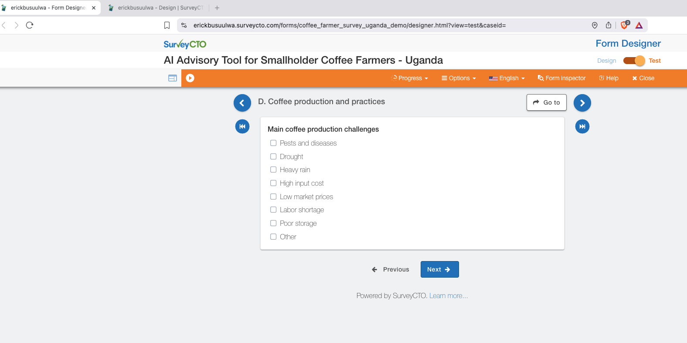
Select-multiple production challenges module in test mode.

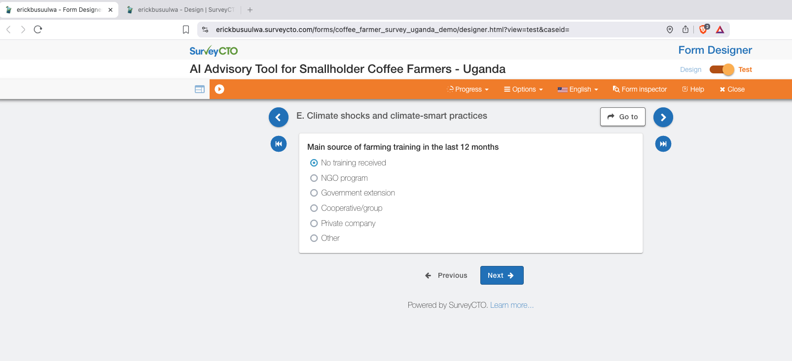
Training source question under climate and climate-smart agriculture module.

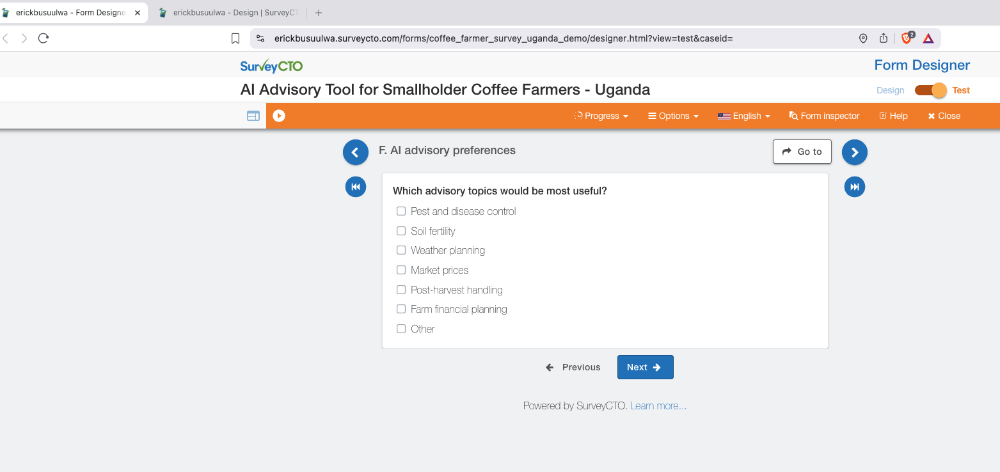
AI advisory preference module with multi-select topics.

### Workflow and QA evidence

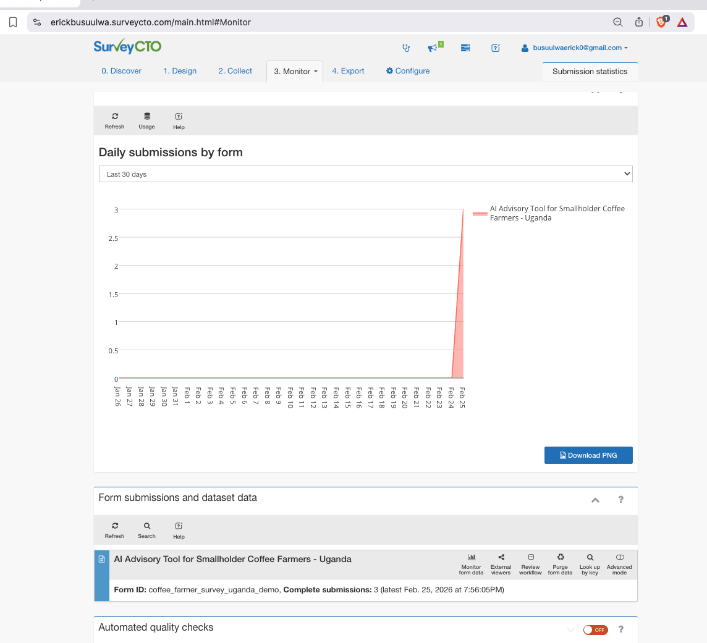
Submission monitoring view for QA checks.

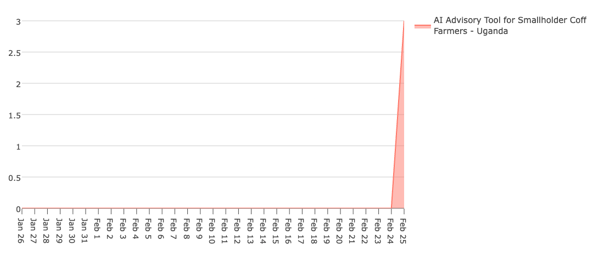
Daily submission trend view from monitoring dashboard.

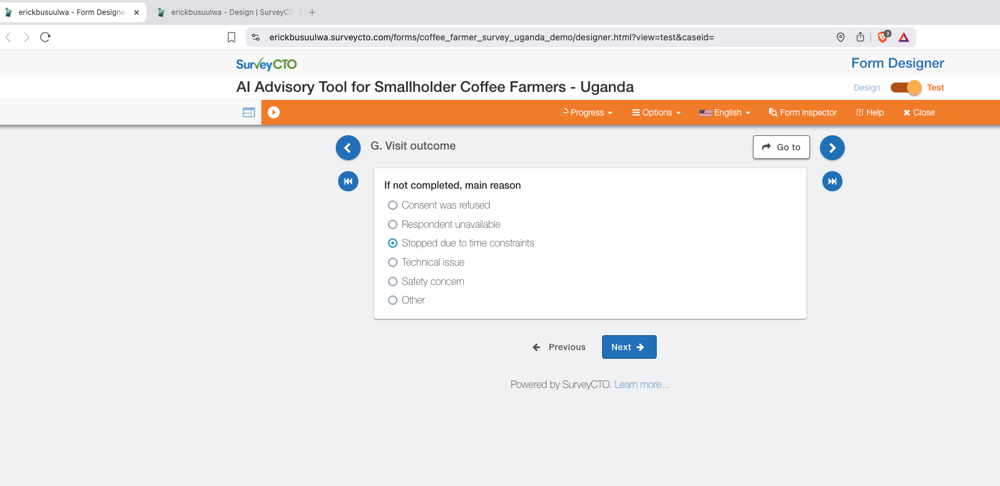
Incomplete interview flow captured for visit outcome testing.

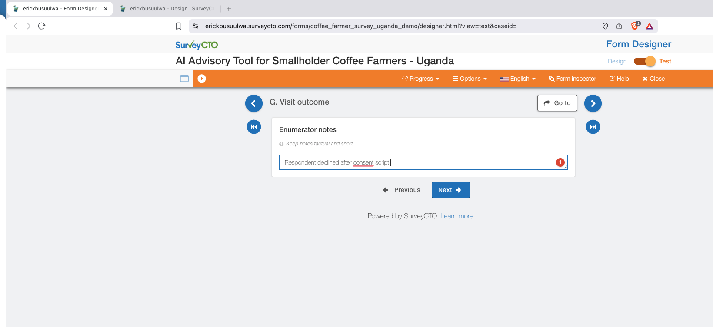
Enumerator notes field in final module.

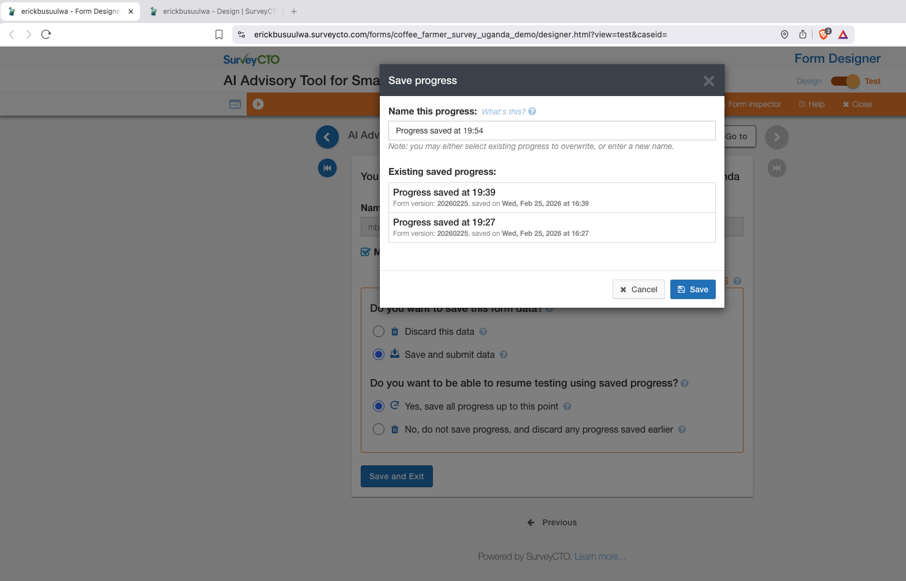
Saved-progress testing path showing resume options.

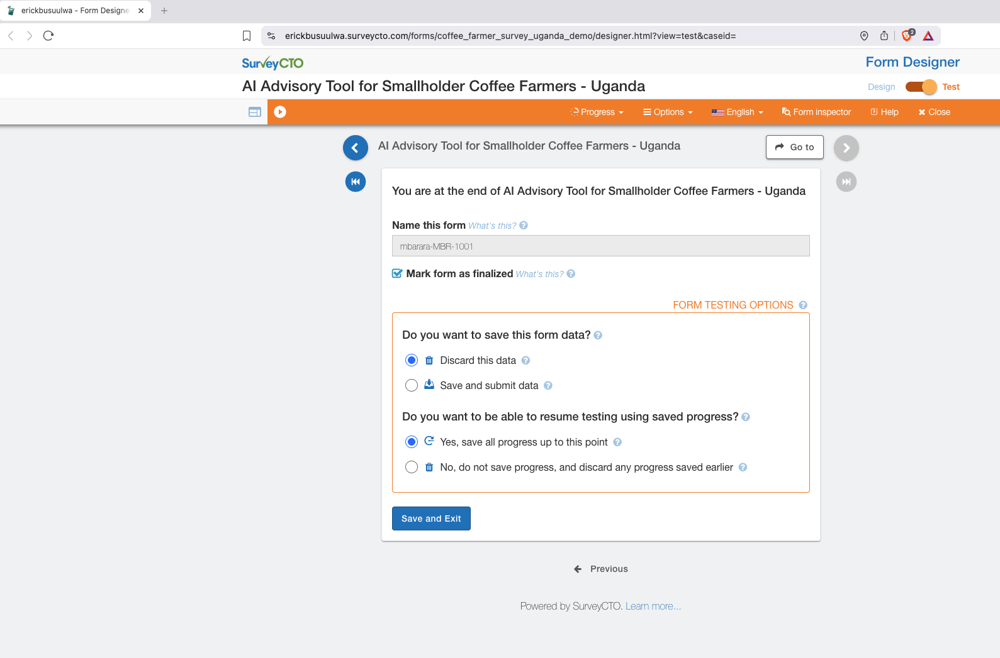
End-of-form testing controls and finalization path.

### Deployment and device setup evidence

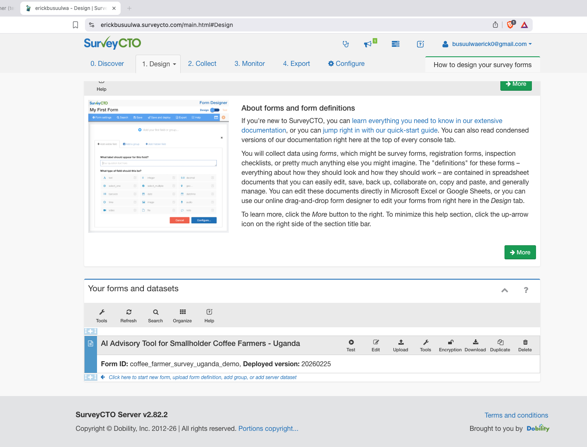
Form listing and deployed version in SurveyCTO console.

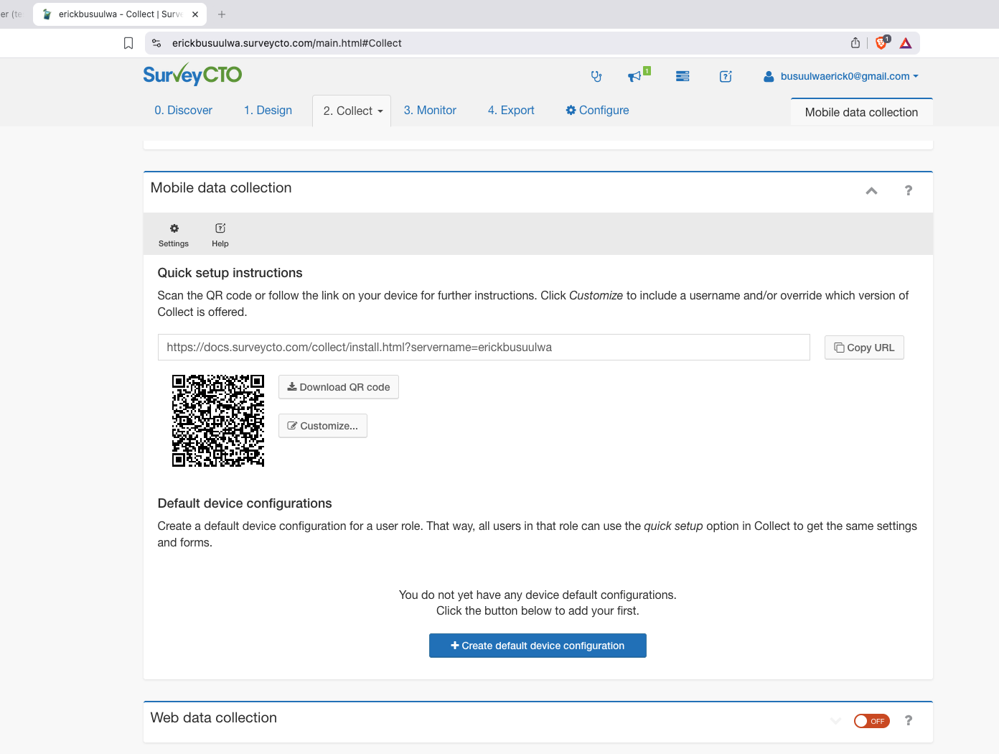
SurveyCTO Collect setup page in server console.

Device onboarding QR code for field deployment.

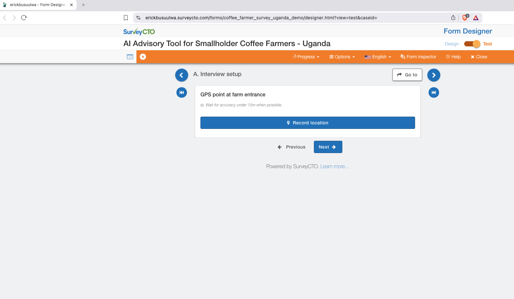
Example location capture evidence from form testing.

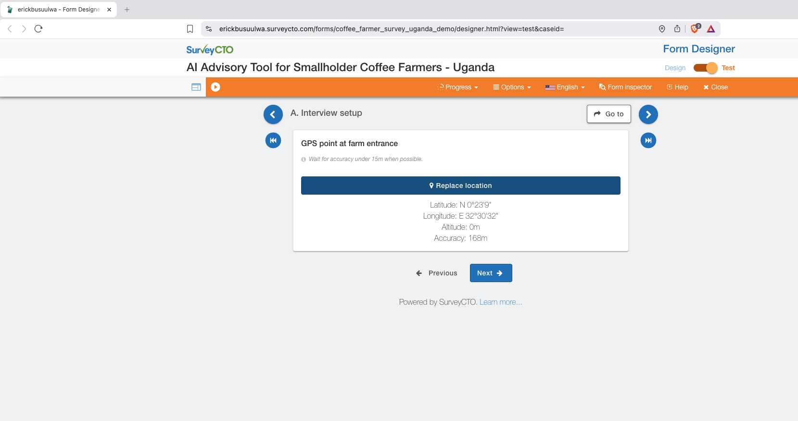
Additional location capture evidence from testing workflow.

## Assumptions and limitations

- Agronomy content is illustrative and intentionally lightweight.
- The focus is technical form quality for field operations, translation structure, skip logic integrity, and data quality controls.
- Luganda translations are simplified for enumerator usability and may require local language review before production rollout.

## License

This project is shared publicly for portfolio review. See `LICENSE`.
